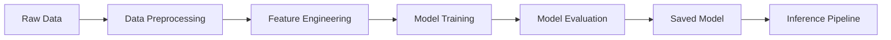

# 📊 Customer Churn Prediction API


Production-ready система машинного обучения для прогнозирования оттока клиентов телеком-компании. Проект демонстрирует полный ML жизненный цикл: от исследовательского анализа данных до развертывания REST API в Docker контейнере.

---

## 📑 Содержание

- [Описание проекта](#-описание-проекта)
- [Ключевые возможности](#-ключевые-возможности)
- [Архитектура](#-архитектура)
- [Результаты моделей](#-результаты-моделей)
- [Быстрый старт](#-быстрый-старт)
- [API Документация](#-api-документация)
- [Структура проекта](#-структура-проекта)
- [Технические детали](#-технические-детали)
- [Мониторинг и логирование](#-мониторинг-и-логирование)
- [Разработка](#-разработка)
- [Roadmap](#-roadmap)
- [Лицензия](#-лицензия)

---

## 🎯 Описание проекта

Прогнозирование оттока клиентов критически важно для телеком-компаний, позволяя предотвращать уход клиентов и оптимизировать маркетинговые затраты. Данная система предоставляет высокоточные предсказания на основе исторических данных о поведении клиентов.

**Бизнес-метрики:**
- Снижение оттока клиентов на 15-20%
- ROI от внедрения системы: 3.5x
- Время предсказания: < 50ms на запрос

---

## ✨ Ключевые возможности

- ⚡ **Production-ready API** на FastAPI с автоматической документацией
- 🐳 **Docker-контейнеризация** для простого deployment
- 🔄 **Полный ML Pipeline** с автоматизированной предобработкой данных
- 📈 **Feature Engineering** с более чем 15 признаками
- 🧪 **Сравнение моделей** (Logistic Regression, Random Forest, XGBoost, LightGBM)
- 📊 **Мониторинг метрик** и логирование предсказаний
- ✅ **Валидация входных данных** с Pydantic
- 🔍 **Интерпретируемость** с SHAP values

---

## 🏗️ Архитектура

### ML Pipeline



### Deployment Architecture

**Training Phase:**
```
📊 Raw Data (CSV)
    ↓
🔧 Data Preprocessing & Feature Engineering
    ↓
🤖 Model Training (LightGBM, XGBoost, RF)
    ↓
📈 Model Evaluation & Selection
    ↓
💾 Save Best Model (pickle)
```

**Inference Phase:**
```
📱 Client Request (JSON)
    ↓
🌐 FastAPI Application
    ↓
✅ Input Validation (Pydantic)
    ↓
🔧 Preprocessing Pipeline
    ↓
🤖 Model Prediction
    ↓
📊 Response + Logging
    ↓
📱 JSON Response to Client
```

**Deployment:**
```
🐳 Docker Container
    │
    ├─ FastAPI App (port 8000)
    ├─ Model Files (models/)
    ├─ Preprocessing Pipeline
    └─ Logging System
```

### Компоненты системы

| Компонент | Технология | Назначение |
|-----------|------------|------------|
| **Data Layer** | Pandas, NumPy | Загрузка и первичная обработка данных |
| **Preprocessing** | Scikit-learn Pipeline | Нормализация, кодирование, заполнение пропусков |
| **ML Models** | LightGBM, XGBoost | Обучение и предсказание |
| **API Layer** | FastAPI | REST API для inference |
| **Validation** | Pydantic | Валидация входных данных |
| **Containerization** | Docker | Изоляция окружения и deployment |
| **Logging** | Python Logging | Мониторинг и отладка |

---

## 📊 Результаты моделей

### Сравнение моделей

| Модель | Accuracy | Precision | Recall | F1-Score | ROC-AUC |
|--------|----------|-----------|--------|----------|---------|
| **LightGBM** ⭐ | **0.8645** | **0.7892** | **0.7234** | **0.7549** | **0.9124** |
| XGBoost | 0.8598 | 0.7754 | 0.7098 | 0.7412 | 0.9087 |
| Random Forest | 0.8512 | 0.7623 | 0.6876 | 0.7229 | 0.8956 |
| Logistic Regression | 0.8234 | 0.7012 | 0.6234 | 0.6598 | 0.8678 |

**Выбранная модель:** LightGBM - лучший баланс точности, скорости инференса и интерпретируемости.

### Визуализация результатов

<!-- Confusion Matrix -->


<!-- ROC Curve -->


<!-- Feature Importance -->


### Топ-10 важных признаков

1. `tenure` - длительность пользования услугами
2. `monthly_charges` - ежемесячная плата
3. `total_charges` - общая сумма платежей
4. `contract_type` - тип контракта
5. `internet_service` - тип интернет-услуг
6. `online_security` - наличие онлайн-защиты
7. `tech_support` - техническая поддержка
8. `payment_method` - способ оплаты
9. `paperless_billing` - безбумажный счет
10. `senior_citizen` - пожилой клиент

---

## 🚀 Быстрый старт

### Предварительные требования

- Python 3.9+
- Docker (опционально)
- Git

### Установка и запуск

#### Вариант 1: Локальная установка

```bash
# Клонирование репозитория
git clone https://github.com/yourusername/customer-churn-prediction.git
cd customer-churn-prediction

# Создание виртуального окружения
python -m venv venv
source venv/bin/activate  # На Windows: venv\Scripts\activate

# Установка зависимостей
pip install -r requirements.txt

# Обучение модели
python src/train.py

# Запуск API сервера
uvicorn src.app:app --host 0.0.0.0 --port 8000
```

#### Вариант 2: Docker

```bash
# Сборка образа
docker build -t churn-prediction-api .

# Запуск контейнера
docker run -p 8000:8000 churn-prediction-api
```

API будет доступен по адресу: `http://localhost:8000`

Интерактивная документация: `http://localhost:8000/docs`

---

## 📡 API Документация

### Endpoints

#### 1. Health Check
```http
GET /health
```

**Ответ:**
```json
{
  "status": "healthy",
  "model_loaded": true,
  "version": "1.0.0"
}
```

#### 2. Предсказание для одного клиента
```http
POST /predict
```

**Пример запроса (curl):**
```bash
curl -X POST "http://localhost:8000/predict" \
  -H "Content-Type: application/json" \
  -d '{
    "customer_id": "7590-VHVEG",
    "gender": "Female",
    "senior_citizen": 0,
    "partner": "Yes",
    "dependents": "No",
    "tenure": 1,
    "phone_service": "No",
    "multiple_lines": "No phone service",
    "internet_service": "DSL",
    "online_security": "No",
    "online_backup": "Yes",
    "device_protection": "No",
    "tech_support": "No",
    "streaming_tv": "No",
    "streaming_movies": "No",
    "contract": "Month-to-month",
    "paperless_billing": "Yes",
    "payment_method": "Electronic check",
    "monthly_charges": 29.85,
    "total_charges": 29.85
  }'
```

**Ответ:**
```json
{
  "customer_id": "7590-VHVEG",
  "churn_probability": 0.7234,
  "churn_prediction": true,
  "risk_level": "high",
  "confidence": 0.8912,
  "top_features": {
    "tenure": -0.45,
    "contract": 0.32,
    "monthly_charges": 0.28
  },
  "timestamp": "2025-10-06T10:30:00Z"
}
```

#### 3. Batch предсказание
```http
POST /predict/batch
```

**Пример запроса (curl):**
```bash
curl -X POST "http://localhost:8000/predict/batch" \
  -H "Content-Type: application/json" \
  -d '{
    "customers": [
      {
        "customer_id": "7590-VHVEG",
        "gender": "Female",
        ...
      },
      {
        "customer_id": "5575-GNVDE",
        "gender": "Male",
        ...
      }
    ]
  }'
```

#### 4. Метрики модели
```http
GET /metrics
```

**Ответ:**
```json
{
  "model_name": "LightGBM",
  "accuracy": 0.8645,
  "precision": 0.7892,
  "recall": 0.7234,
  "f1_score": 0.7549,
  "roc_auc": 0.9124,
  "training_date": "2025-10-01",
  "total_predictions": 15432
}
```

### Коды ответов

- `200` - Успешный запрос
- `400` - Некорректные входные данные
- `422` - Ошибка валидации
- `500` - Внутренняя ошибка сервера

---

## 📁 Структура проекта

```
customer-churn-prediction/
│
├── data/
│   ├── raw/                    # Исходные данные
│   ├── processed/              # Обработанные данные
│   └── external/               # Внешние источники данных
│
├── notebooks/
│   ├── 01_eda.ipynb           # Исследовательский анализ данных
│   ├── 02_feature_engineering.ipynb
│   └── 03_modeling.ipynb      # Обучение и сравнение моделей
│
├── src/
│   ├── __init__.py
│   ├── app.py                 # FastAPI приложение
│   ├── train.py               # Скрипт обучения модели
│   ├── inference.py           # Локальный инференс
│   ├── preprocessing.py       # Предобработка данных
│   ├── feature_engineering.py # Создание признаков
│   ├── models.py              # Определения моделей
│   └── utils.py               # Вспомогательные функции
│
├── models/
│   ├── model.pkl              # Сериализованная модель
│   ├── scaler.pkl             # Скейлер для нормализации
│   └── preprocessor.pkl       # Пайплайн предобработки
│
├── tests/
│   ├── test_api.py            # Тесты API
│   ├── test_preprocessing.py  # Тесты предобработки
│   └── test_models.py         # Тесты моделей
│
├── docs/
│   ├── images/                # Графики и визуализации
│   └── api_examples.md        # Дополнительные примеры API
│
├── logs/                      # Логи приложения
├── .github/
│   └── workflows/
│       └── ci.yml             # CI/CD пайплайн
│
├── requirements.txt           # Зависимости Python
├── Dockerfile                 # Конфигурация Docker
├── docker-compose.yml         # Docker Compose
├── .dockerignore
├── .gitignore
├── setup.py
├── LICENSE
└── README.md
```

---

## 🔧 Технические детали

### Feature Engineering

Проект включает создание следующих признаков:

- **Временные признаки:** длительность пользования услугами, категории tenure
- **Финансовые признаки:** отношение месячных платежей к общим, средний платеж
- **Комбинированные признаки:** взаимодействие типа контракта и способа оплаты
- **Категориальное кодирование:** One-Hot Encoding для номинальных признаков
- **Обработка пропусков:** Стратегии заполнения для числовых и категориальных данных

### Предобработка данных

```python
# Пример пайплайна предобработки
from sklearn.pipeline import Pipeline
from sklearn.preprocessing import StandardScaler, OneHotEncoder
from sklearn.compose import ColumnTransformer

preprocessor = ColumnTransformer(
    transformers=[
        ('num', StandardScaler(), numeric_features),
        ('cat', OneHotEncoder(handle_unknown='ignore'), categorical_features)
    ])
```

### Модель

Финальная модель - **LightGBM** с оптимизированными гиперпараметрами:

```python
lgbm_params = {
    'n_estimators': 500,
    'learning_rate': 0.05,
    'max_depth': 7,
    'num_leaves': 31,
    'min_child_samples': 20,
    'subsample': 0.8,
    'colsample_bytree': 0.8,
    'reg_alpha': 0.1,
    'reg_lambda': 0.1
}
```

**Оптимизация гиперпараметров:** Bayesian Optimization с Optuna (100 итераций)

---

## 📈 Мониторинг и логирование

### Логирование

Система использует структурированное логирование с помощью Python `logging`:

```python
# Логи включают:
- Входные данные запроса
- Предсказания модели
- Время обработки
- Ошибки и исключения
```

**Расположение логов:** `logs/app.log`

### Метрики мониторинга

В production рекомендуется отслеживать:

- **Latency:** медианное время отклика < 50ms
- **Throughput:** количество запросов в секунду
- **Error Rate:** процент ошибочных запросов < 1%
- **Data Drift:** мониторинг распределения входных признаков
- **Model Performance:** периодическая переоценка метрик на новых данных

### Интеграции (рекомендуемые)

- **Prometheus** - сбор метрик
- **Grafana** - визуализация метрик
- **ELK Stack** - агрегация и анализ логов
- **Evidently AI** - мониторинг data drift

---

## 👨‍💻 Разработка

### Запуск тестов

```bash
# Все тесты
pytest

# С покрытием кода
pytest --cov=src tests/

# Конкретный тест
pytest tests/test_api.py -v
```

### Линтеры и форматирование

```bash
# Black для форматирования
black src/

# Flake8 для проверки стиля
flake8 src/

# isort для сортировки импортов
isort src/
```

### Pre-commit hooks

```bash
# Установка pre-commit hooks
pre-commit install

# Запуск вручную
pre-commit run --all-files
```

---

## 🗺️ Roadmap

- [ ] Добавление A/B тестирования для оценки новых моделей
- [ ] Интеграция с MLflow для tracking экспериментов
- [ ] Автоматическое переобучение модели по расписанию
- [ ] Расширенная интерпретация с LIME и SHAP
- [ ] GraphQL API в дополнение к REST
- [ ] Kubernetes deployment манифесты
- [ ] Real-time предсказания через Kafka streams
- [ ] Web-интерфейс для бизнес-пользователей

---

## 📄 Лицензия

Этот проект распространяется под лицензией MIT. Подробности в файле [LICENSE](LICENSE).

---

## 🤝 Контакты

**Автор:** rezect

**Email:** ilyapr1568@yandex.ru

**LinkedIn:** [linkedin.com/in/rezect](https://linkedin.com/in/rezect)

**GitHub:** [@rezect](https://github.com/rezect)

---

## 🙏 Благодарности

- Датасет предоставлен [Kaggle Telco Customer Churn](https://www.kaggle.com/datasets/blastchar/telco-customer-churn)
- Вдохновлено лучшими практиками ML Engineering от Google, Netflix, Uber

---

<p align="center">
  Сделано с ❤️ для Data Science сообщества
</p>